# CY8CKIT-062-BLE — PSoC 6 BLE bring-up, apps and boot workaround

Everything in this repo is tied to a **CY8CKIT-062-BLE** board (PSoC 6 BLE,
**CY8C6347BZI-BLD53**, dual core: CM0p + CM4, 1 MB flash, 288 KB SRAM).

> **The one important caveat:** the PSoC 6 boot ROM on this board does **not**
> auto-boot any application after reset / power-cycle. The CM0+ is left *held*
> by the ROM, so apps never start on their own — a **debugger-assisted boot**
> (one OpenOCD command) is required. See [The boot issue](#the-boot-issue) and
> [BOOT_ISSUE.md](BOOT_ISSUE.md).

## Board

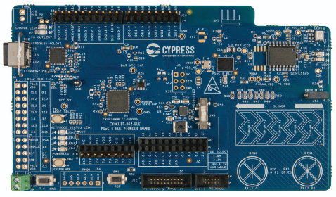
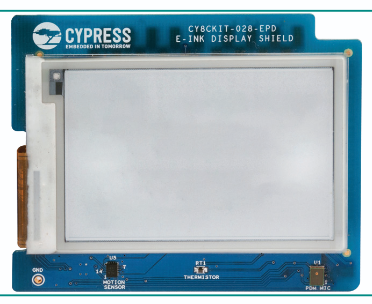
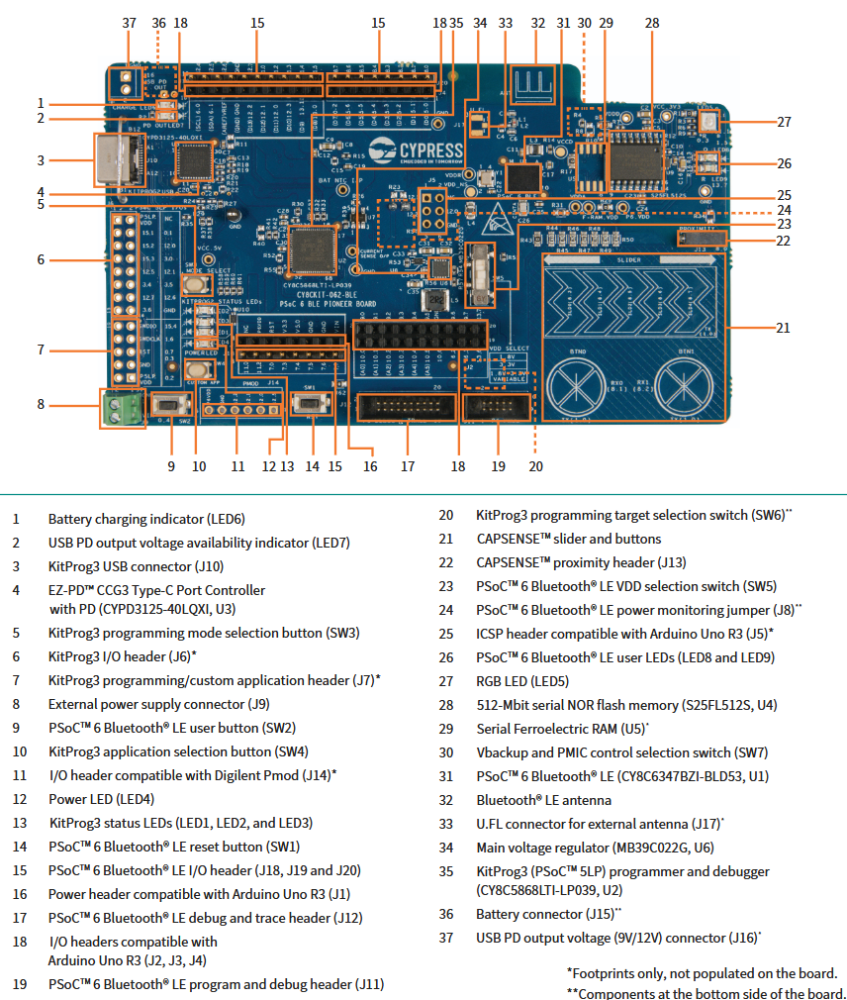
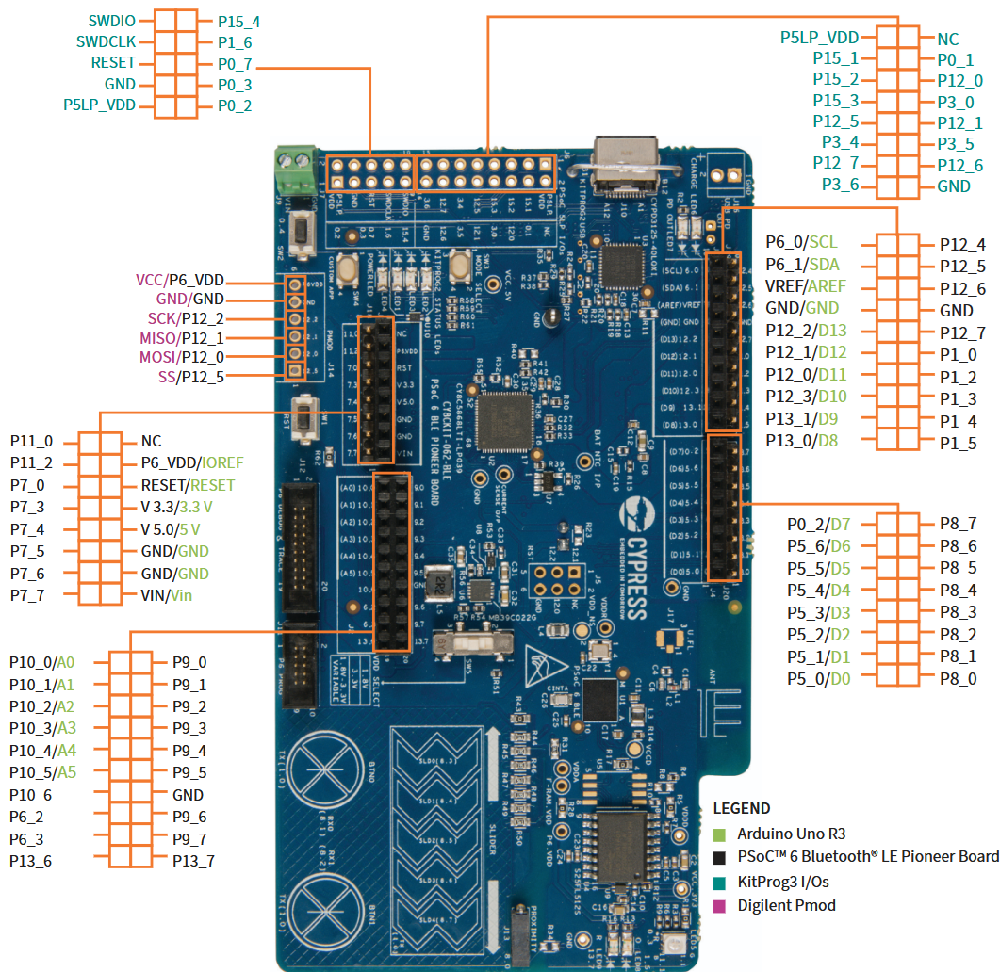
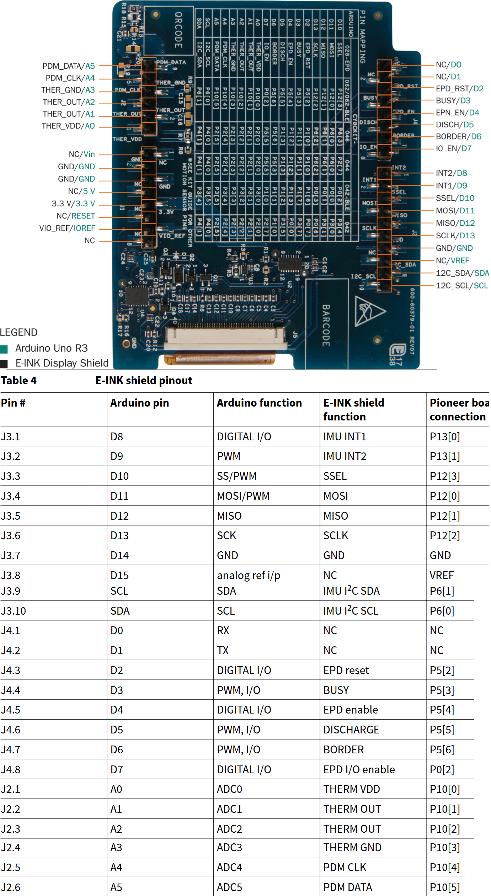
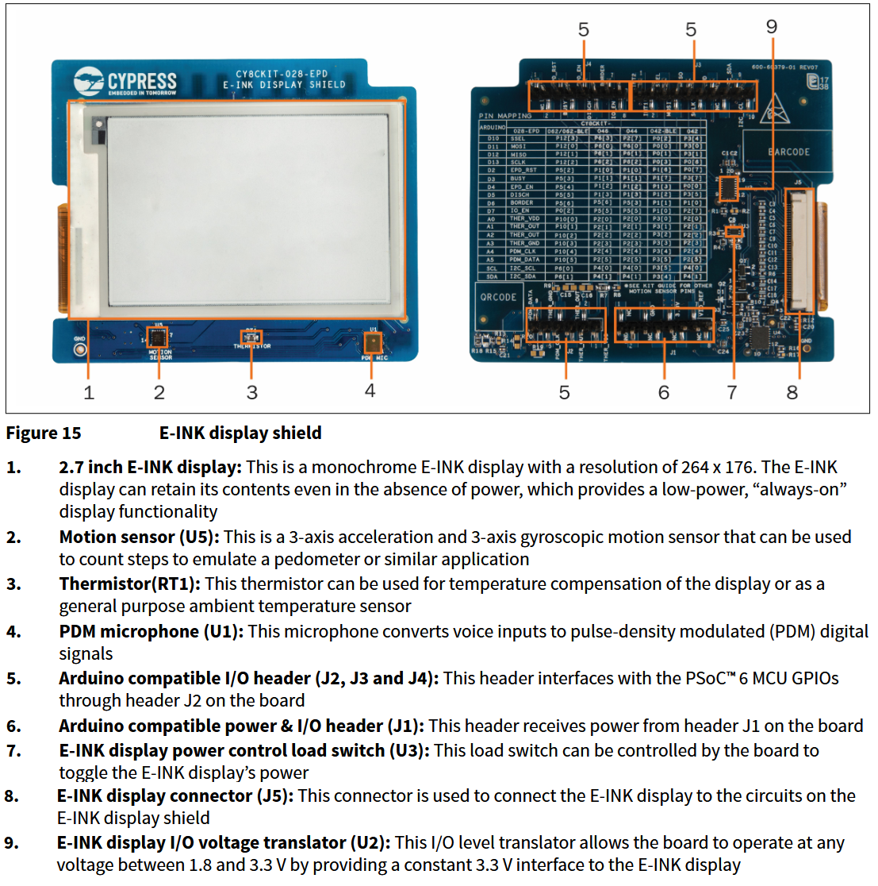

Block diagrams (board peripherals):

| Block | Diagram |
|-------|---------|
| MCU / pinout | 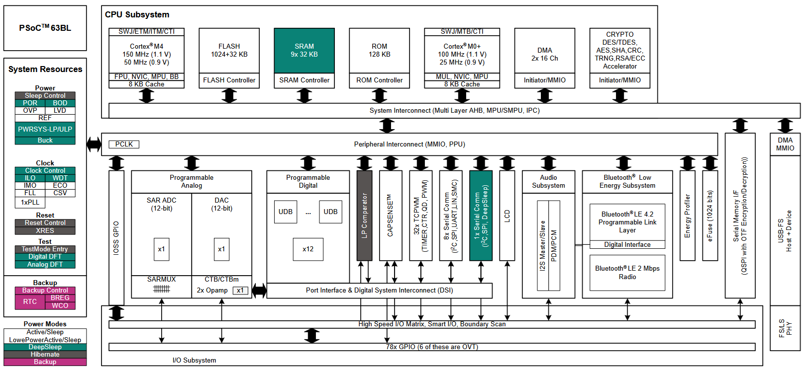 |
| Power | 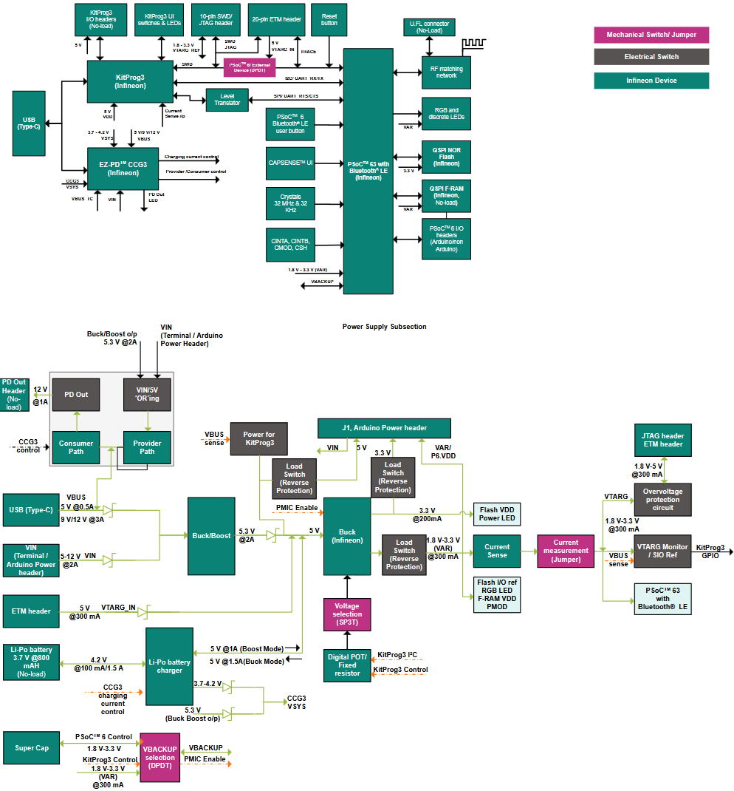 |
| UART | 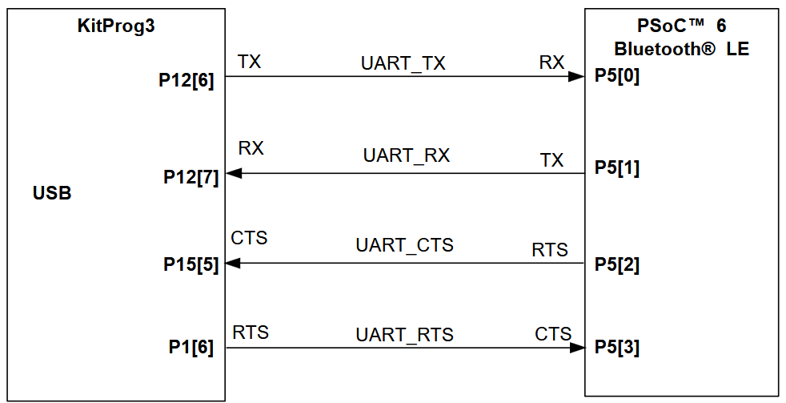 |
| SPI | 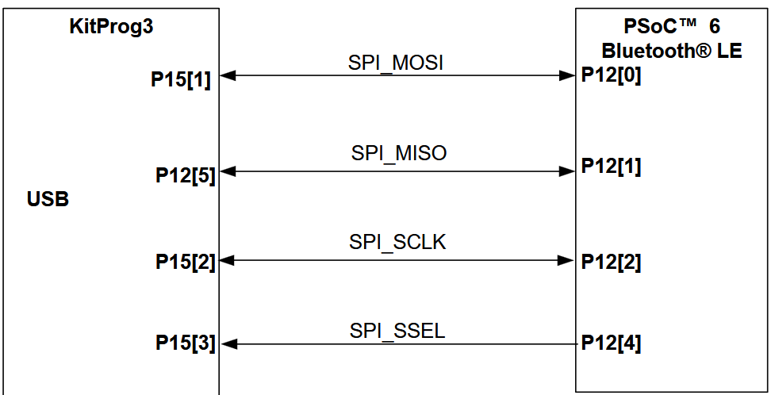 |
| I2C (IIC) | 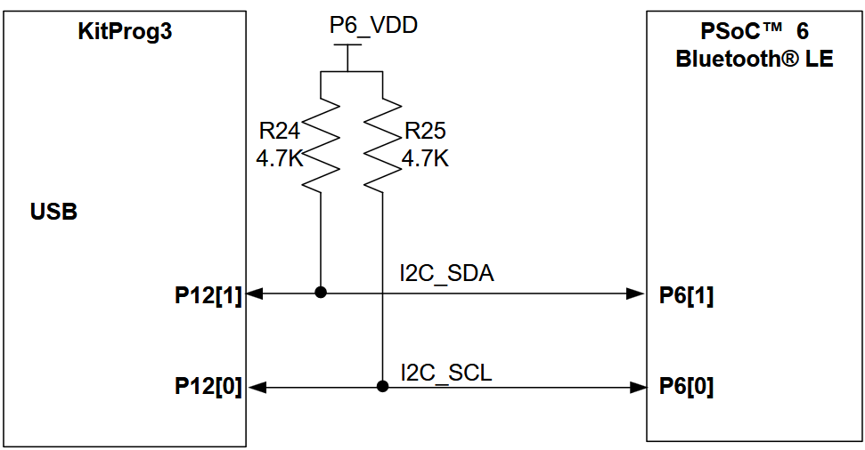 |
| USB Type-C | 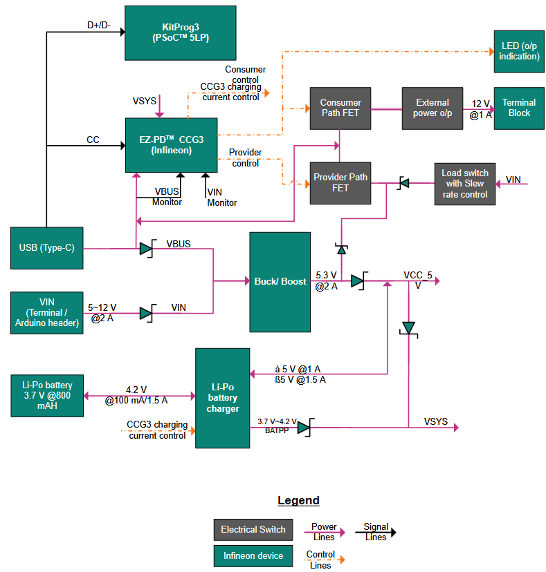 |

Key onboard resources used by the demos:

- **LEDs** (active-low): LED0 `P11.1`, LED1 `P0.3`, LED2 `P1.1`, LED4 `P1.5`, LED5 `P13.7`
- **UART** (KitProg3 virtual COM port): **SCB5**, `P5[1]` TX / `P5[0]` RX, **115200 8N1**
- **Debug/programming**: on-board KitProg3 (SWD), SW3 = mode select

## Apps

| App | Core(s) | What it does | Status |
|-----|---------|--------------|--------|
| [`app/blink_hello_m0p`](app/blink_hello_m0p) | CM0+ only | Boot-issue demo: runs at **100 MHz**, blinks LED4/LED5, prints alive messages on UART | working |
| [`app/blink_hello_dualcore`](app/blink_hello_dualcore) | CM0p + CM4 | Dual-core blink + shared-UART `printf`, both cores at **100 MHz** | working |

### blink_hello_m0p — the boot-issue demo

CM0+-only, built to demonstrate the boot issue and the workaround:

- Runs at **100 MHz** (FLL: `8 MHz IMO / 20 * 500 / 2`).
- Blinks **LED4 (P1.5)** and **LED5 (P13.7)** sequentially.
- Prints over the KitProg3 UART (115200 8N1):

  ```
  === CM0+ Boot Demo @ 100 MHz ===
  If you see this, the app was booted manually
  (boot ROM held CM0+ in PWR_MODE=1 otherwise)
  [CM0+] alive, SysClk = 100000000 Hz
  ```

- After a normal reset / power-cycle **nothing appears** on the UART and no LED
  blinks — the app is not running (boot ROM hold). After the debugger-assisted
  boot it runs.

> PDL quirk baked into this demo: `Cy_SysClk_FllManualConfigure()` refuses to
> program the FLL if it is already enabled. The ROM leaves the FLL enabled at
> its default (~25 MHz), so `clock_init()` calls `Cy_SysClk_FllDisable()` first.
> (The dualcore app gets away with this because `SystemInit()` disables the FLL.)

## The boot issue

The short version (full diagnosis in [BOOT_ISSUE.md](BOOT_ISSUE.md)):

- After reset, the ROM parks the CM0+ at `PWR_MODE = 1` (held):
  `0x40210080 = 0xfa050001`, `0x40210400 = 0x00000f03` (read-only).
- A valid TOC2 **does not** fix it (proven with a clean physical power cycle).
- KitProg3 SW3 MODE SELECT only switches the USB interface.
- The whole app chain runs fine when the CM0+ image is started manually — so
  **the board, KitProg, and all images are good**. It is a tool/driver release
  interaction, not a hardware or code defect.

## How to build

Both apps are built with `build.sh` (run in **Git Bash / MSYS2**; no
ModusToolbox project needed — plain arm-gcc + the MTB PDL sources).

Prerequisites (paths are hard-coded in the scripts):

- GNU Arm toolchain at `D:\arm-none-eabi-tc\bin\`
- MTB PDL at `D:\board_database\main-cy8ckit-062\mtb-pdl-cat1-release-v3.23.0\`
- CMSIS / core-lib headers are **vendored** in each app's `ext/cmsis` (no external dependency)

```
cd app/blink_hello_m0p
./build.sh           # -> build/cm0p.hex

cd ../blink_hello_dualcore
./build.sh           # -> build/cm0p.hex, cm4.hex, combined.hex
```

## How to flash / boot

OpenOCD (Infineon KitProg tools):

```
C:\Infineon\Tools\ModusToolboxProgtools-1.9\openocd\bin\openocd.exe
```

### First time / after a code change — program + boot

`tools/flash_and_boot.tcl` programs the hex and jumps to the CM0+ image:

```
C:\Infineon\Tools\ModusToolboxProgtools-1.9\openocd\bin\openocd.exe -c "set HEX D:/cy8ckit-prj/app/blink_hello_m0p/build/cm0p.hex" -c "adapter speed 1000" -c "source [find interface/kitprog3.cfg]" -c "source [find target/infineon/cy8c6xx.cfg]" -c "init" -c "source D:/cy8ckit-prj/tools/flash_and_boot.tcl"
```

For the dualcore app, point `HEX` at `.../blink_hello_dualcore/build/combined.hex`.

### After a power cycle / reset — boot only (no re-flash)

`tools/boot_only.tcl` re-jumps to the already-flashed CM0+ image:

```
C:\Infineon\Tools\ModusToolboxProgtools-1.9\openocd\bin\openocd.exe -c "adapter speed 1000" -c "source [find interface/kitprog3.cfg]" -c "source [find target/infineon/cy8c6xx.cfg]" -c "init" -c "source D:/cy8ckit-prj/tools/boot_only.tcl"
```

Then open a serial terminal on the KitProg3 COM port at **115200 8N1**.
The app keeps running after the OpenOCD session exits (verified: LEDs keep
blinking).

